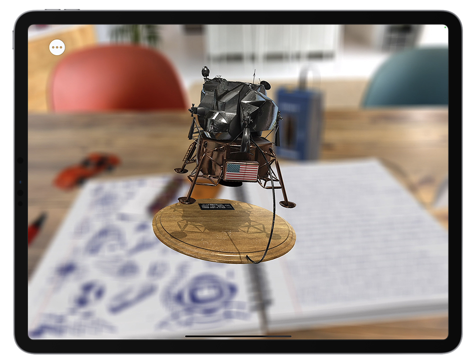

# Imaging Technology Inspiration Section

## Technology of choice: Augmented Reality (AR)

### Source of inspiration
The imaging techniques I chose are inspired by the mobile game Pokemon Go, which successfully implements augmented reality (AR) on mobile devices. By overlaying virtual elements onto real-world scenes, it provides a unique and interactive gaming experience, making virtual Pokemon appear as if they are in the real world.

"Pokemon Go" uses AR technology to capture the real-world environment through the phone's camera and projects virtual Pokémon onto the screen. This technology's use extends beyond gaming to fields such as education, health, and business, highlighting AR's significant potential to enhance user interaction and experience.

# Coding technology exploration section

## Technologies of choice: ARKit and ARCore

### Technical Description
ARKit (Apple) and ARCore (Google) are currently the most advanced augmented reality development frameworks. They provide developers with rich tools and APIs to achieve high-quality AR experiences. These frameworks support facial tracking, object recognition, environment understanding and other functions, allowing developers to create engaging AR applications on iOS and Android platforms.

Using ARKit and ARCore, developers can implement applications like "Pokemon Go" that perfectly integrate virtual objects with the real world. For example, you could develop an educational app that lets students explore historical landmarks or biological specimens through AR.

### Code Links
For more detailed information and example code about ARKit and ARCore, please visit the following links:
(https://developer.apple.com/augmented-reality/arkit/)
(https://developers.google.com/ar)
